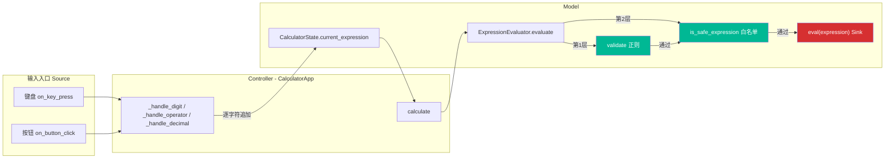

# eval 白名单安全性分析

> 分析对象：`ExpressionEvaluator` 中 `eval()` 前的两层过滤（`validate` + `is_safe_expression`）
> 分析目标：白名单能否挡住所有危险输入？键盘输入能否绕过？
> 约束：本文档仅做分析，不修改任何计算器业务代码，不影响现有计算与输入响应逻辑。

---

## 1. 范围与方法

本文聚焦一个核心问题链：

1. `eval` 前那层白名单过滤，到底能不能挡住所有危险输入？
2. 有没有可能从键盘输入就绕过去？

分析方法遵循「源 → 汇」追踪思路：

- **源（Source）**：定位所有可向表达式注入字符的入口（键盘、按钮）。
- **汇（Sink）**：定位危险操作 `eval(expression)`（[expression_evaluator.py:77](file:///src/expression_evaluator.py#L77)）。
- **中间屏障**：逐层检查源到汇之间是否存在编码 / 校验 / 授权检查，以及能否被绕过。

> 说明：本分析只读不改。下文所有结论均以仓库现有代码为准，并已用项目实际代码验证（验证脚本用后即删，未留存任何文件）。

---

## 2. 数据流追踪（Source → Sink）

整个输入到求值的链路如下，三层职责严格遵循现有 MVC 架构：



关键事实：

- 表达式 `current_expression` 是**逐字符累积**而成的，不是一次性外部字符串（见 [models.py:8](file:///src/models.py#L8)）。
- 累积动作只有三个：[_handle_digit](file:///src/calculator_app.py#L149-L157)、[_handle_operator](file:///src/calculator_app.py#L159-L170)、[_handle_decimal](file:///src/calculator_app.py#L172-L180)。
- `calculate()` 把累积好的表达式交给 [evaluate](file:///src/expression_evaluator.py#L39-L89)，后者在两层校验通过后才调用 `eval`。

因此「能否注入危险字符」取决于**入口处允许哪些字符**，而「能否绕过白名单」取决于**入口字符集与白名单的关系**。

---

## 3. 防御层剖析

`evaluate` 在到达 `eval` 前串行设置了两道关卡，**两道都必须通过**（任一失败即返回错误，见 [expression_evaluator.py:52-59](file:///src/expression_evaluator.py#L52-L59)）：

| 层级 | 位置 | 机制 | 允许的字符集 |
|------|------|------|--------------|
| 第 1 层 `validate` | [expression_evaluator.py:12-36](file:///src/expression_evaluator.py#L12-L36) | 正则 `^[\d+\-*/().\s]+$` + 括号配对 | 数字、`+ - * / ( ) .`、空白（`\s` 含空格/制表/换行等） |
| 第 2 层 `is_safe_expression` | [expression_evaluator.py:92-120](file:///src/expression_evaluator.py#L92-L120) | 字符白名单集合 + `__` 检查 + `isalpha` 检查 | 数字、`+ - * / ( ) .`、**仅空格** |

两点观察：

1. **有效过滤集是两层的交集**。第 2 层比第 1 层更严（只允许空格，不允许制表符 / 换行），所以最终生效的是第 2 层的集合：`set('0123456789+-*/(). ')`（[expression_evaluator.py:107](file:///src/expression_evaluator.py#L107)）。
2. 第 2 层里的 `__` 检查与 `isalpha` 检查其实是**冗余的纵深防御**——因为 `_` 和任何字母本就不在白名单集合里，会在上一行被先拒掉。冗余但无害。

---

## 4. 核心问题一：白名单能否挡住所有危险输入？

### 4.1 字符集对比

构造 `eval` 代码注入所需的「危险字符」，与白名单的对照：

| 危险用途 | 所需字符 | 白名单是否放行 |
|----------|----------|----------------|
| 引用内置 / 模块名（`__import__`、`open`、`exec`、`os`） | 字母 `a-z A-Z` | ❌ 拒（不在集合 + `isalpha` 兜底） |
| 双下划线属性（`__builtins__`、`__class__`） | `_` 下划线 | ❌ 拒（不在集合 + `__` 兜底） |
| 字符串字面量 | 引号 `'` `"` | ❌ 拒 |
| 下标 / 字典 / 集合 | `[` `]` `{` `}` | ❌ 拒 |
| 多参数 / 元组元素分隔 | `,` 逗号 | ❌ 拒 |
| 切片 / lambda / 复合语句 | `:` `;` | ❌ 拒 |
| 赋值 / 关键字参数 | `=` | ❌ 拒 |
| 科学计数 / 进制 / 虚数（`1e5` `0x1F` `1j`） | 字母 `e x o b j` | ❌ 拒 |

### 4.2 实测验证（基于项目真实代码）

用项目自身代码对一批注入原语跑 `validate` + `is_safe_expression`，结果全部被拒：

```
"__import__('os')"   validate=False safe=False
'__builtins__'       validate=False safe=False
'open("a")'          validate=False safe=False
'os.system'          validate=False safe=False
"exec('1')"          validate=False safe=False
'1e5'                validate=False safe=False   # 字母 e
'0x1F'               validate=False safe=False   # 字母 x
'1j'                 validate=False safe=False   # 字母 j
```

而合法算术全部放行且计算正常：

```
'1+2'   -> (True, '7')
'9*9'   -> (True, '81')
'1/0.5' -> (True, '2.0')
```

### 4.3 `eval` 命名空间里 `__builtins__` 可达吗？

代码调用的是裸 `eval(expression)`（[expression_evaluator.py:77](file:///src/expression_evaluator.py#L77)），没有传自定义 globals，因此命名空间里**确实存在 `__builtins__`**（已验证：`eval("1+1", ns, ns)` 后 `__builtins__ in ns` 为 `True`）。

但这并不构成可利用路径——**要访问 `__builtins__` 必须在表达式里写出这个名字**，而名字需要字母与下划线，二者均被白名单排除。换言之：危险对象「在房间里」，但「钥匙（字母/下划线）」被没收，门打不开。

### 4.4 结论一

针对**代码注入 / RCE**，白名单是有效的：

- 允许字符集 `{数字, + - * / ( ) . 空格}` 无法拼出任何函数名、属性名、字符串字面量、下标、关键字参数或复合语句；
- 因此无法触发 `__import__`、`exec`、`open`、属性穿越（`().__class__` 一类）等任意代码执行链。

> 白名单能挡住所有「代码注入类」危险输入。残余风险不在注入，而在「可用性 / 纵深防御」，见第 6 节。

---

## 5. 核心问题二：键盘输入能否绕过白名单？

### 5.1 键盘入口的字符集

[on_key_press](file:///src/calculator_app.py#L182-L198) 用一串 `if/elif` 决定哪些字符能进入表达式：

```python
if char in "0123456789":      # 数字
    self._handle_digit(char)
elif char in "+-*/":          # 运算符
    self._handle_operator(char)
elif char == ".":             # 小数点
    self._handle_decimal()
elif key in ("Return", "KP_Enter"):  # 计算
    self.calculate()
elif key == "BackSpace":      # 退格
    self.delete_last()
elif key == "Escape":         # 清空
    self.clear()
```

只有命中前三个分支的字符才会被**追加**进 `current_expression`，可追加的字符集为：

```
{ 0 1 2 3 4 5 6 7 8 9 + - * / . }
```

### 5.2 键盘字符集 ⊂ 白名单

对照白名单 `set('0123456789+-*/(). ')`：

- 键盘能输入的 15 个字符，**全部**在白名单内；
- 键盘甚至**无法输入括号 `(` `)`**（按钮也没有，见 [button_layout](file:///src/calculator_app.py#L60-L79)）。

所以键盘输入是白名单的**严格子集**，不可能产生白名单之外的字符，**无法绕过白名单**。

### 5.3 按钮入口同样无法绕过

[on_button_click](file:///src/calculator_app.py#L129-L147) 的 `value` 来自硬编码的 `button_layout`（`C ⌫ 0-9 / * - + . =`），同样是上述子集，且走相同的 `_handle_*` 累积逻辑，结论一致。

### 5.4 结果复用路径也安全

[_handle_operator](file:///src/calculator_app.py#L159-L170) 在显示结果后会执行 `current_expression = last_result + op`。`last_result` 来自 `str(eval(...))`，而能进入 `eval` 的表达式只可能是纯算术，结果只能是数字字符串（如 `"5"`、`"2.0"`），再拼接一个运算符，仍在白名单字符集内，无法注入危险字符。

### 5.5 一个非绕过的行为观察：空字符 substring 陷阱

`on_key_press` 用的是 `char in "0123456789"` 这种**子串包含**判断，而不是集合成员判断。Python 中空串是任意串的子串：

```
"" in "0123456789"  ->  True
"" in "+-*/"        ->  True
```

当按下 Shift / Ctrl / Alt / F1-F12 / 方向键等不产生字符的键时，`event.char == ""`，会命中第一个分支并调用 `_handle_digit("")`：

- 正常输入态：`current_expression += ""`，无变化，**无害**；
- 错误 / 结果态：`current_expression = ""`（[calculator_app.py:152](file:///src/calculator_app.py#L152)），会把刚算出的结果**意外清空**。

这是一个**输入响应逻辑的行为瑕疵**，但**不是安全绕过**——它只追加空串，绝不引入危险字符，因此不构成对白名单的绕过。仅作为观察记录。

### 5.6 结论二

- 键盘与按钮可输入的字符集是白名单的严格子集，**无法从键盘绕过白名单**；
- 空字符 substring 陷阱只会造成「结果被意外清空」的体验问题，**不引入任何危险字符**，不属于绕过。

---

## 6. 残余风险与限制

白名单挡住了代码注入，但并非「挡住所有危险输入」。以下为非注入类的残余风险，**仅作记录与建议，不改动现有代码**：

| # | 类别 | 描述 | 现状 | 建议（不落地） |
|---|------|------|------|----------------|
| R1 | 可用性 / DoS | 白名单放行 `**`，键盘可输入 `9**9**9`（已验证 `validate` 与 `is_safe_expression` 均为 `True`）。该式为 `9**(9**9)`，结果约 3.7 亿位，计算会长时间占用 CPU / 内存甚至触发 `MemoryError`（被通用 `except` 兜为「计算失败」，但卡顿已发生）。 | 非注入，属可用性 | 对幂运算结果位数 / 求值时长设上限，或限制连续 `**` 嵌套深度 |
| R2 | 纵深防御 | 裸 `eval` 命名空间带 `__builtins__`，当前因字符集不可达而安全；一旦未来放宽白名单（如允许字母），会立刻变为可利用。 | 当前不可达 | `eval(expression, {"__builtins__": {}}, {})`，移除内置；或改用 `ast` 解析仅允许 `BinOp/UnaryOp/Num` 节点的安全求值器 |
| R3 | 代码健壮性 | `char in "0123456789"` 是子串判断，依赖「`event.char` 至多 1 字符」的隐含前提，脆弱且引发 R5 行为问题。 | 当前可用 | 改为集合判断 `char in {"0",...,"9"}` 或 `char.isdigit()` |
| R4 | 冗余检查 | `is_safe_expression` 的 `__` / `isalpha` 检查已被字符集合覆盖，属冗余。 | 无害 | 可保留作纵深防御，无需改动 |
| R5 | 输入响应 | 空字符命中 `_handle_digit("")`，会在结果 / 错误态清空表达式（见 5.5）。 | 体验瑕疵 | 在 `on_key_press` 入口对 `char == ""` 提前 `return` |

> 上述 R1 属可用性范畴，按安全审计惯例通常不计为「可利用漏洞」；R2/R3/R5 为纵深防御与健壮性建议。均**不在本次修改范围**，仅作分析记录。

---

## 7. 总结论

1. **白名单能否挡住所有危险输入？**
   对「代码注入 / RCE」类危险输入——**能**。允许字符集无法拼出函数名、属性名、字符串、下标、关键字参数或复合语句，`eval` 命名空间里的 `__builtins__` 因缺少字母 / 下划线而不可达。残余风险是可用性（`**` 巨幂 DoS）与纵深防御，而非注入。

2. **键盘输入能否绕过？**
   ——**不能**。键盘（与按钮）可输入字符集是白名单的严格子集（甚至连括号都输不进去），不存在绕过路径。空字符 substring 陷阱只造成「结果被意外清空」的体验问题，不引入危险字符，不构成绕过。

3. **架构与功能完整性**
   本分析全程只读，未改动 `src/` 下任何业务代码，MVC 架构、计算功能与输入响应逻辑均保持原样。

---

## 附录 A：关键代码位置索引

| 关注点 | 位置 |
|--------|------|
| 键盘入口 | [calculator_app.py:182-198](file:///src/calculator_app.py#L182-L198) |
| 按钮入口 | [calculator_app.py:129-147](file:///src/calculator_app.py#L129-L147) |
| 字符累积 | [calculator_app.py:149-180](file:///src/calculator_app.py#L149-L180) |
| 触发求值 | [calculator_app.py:200-220](file:///src/calculator_app.py#L200-L220) |
| 第 1 层正则校验 | [expression_evaluator.py:12-36](file:///src/expression_evaluator.py#L12-L36) |
| 第 2 层白名单 | [expression_evaluator.py:92-120](file:///src/expression_evaluator.py#L92-L120) |
| 白名单字符集 | [expression_evaluator.py:107](file:///src/expression_evaluator.py#L107) |
| eval 汇点 | [expression_evaluator.py:77](file:///src/expression_evaluator.py#L77) |
| 状态模型 | [models.py:5-11](file:///src/models.py#L5-L11) |
