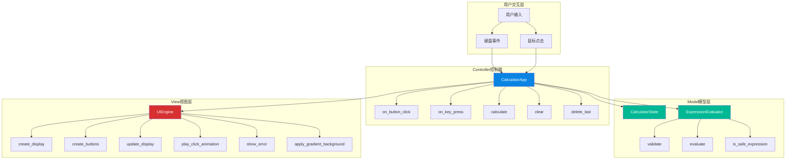
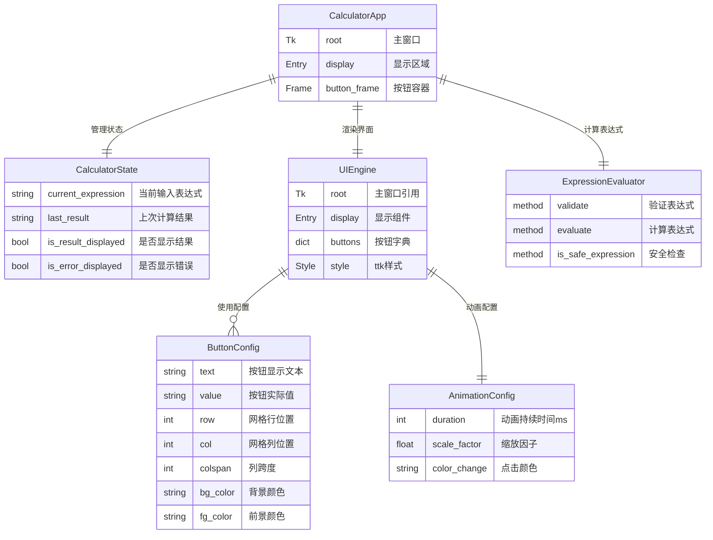

# 炫酷计算器 - 项目设计文档

## 1. 系统架构

本项目采用 MVC（Model-View-Controller）架构模式，实现关注点分离。



## 2. ER 图（数据模型关系）



## 3. 接口清单

### 3.1 CalculatorApp（主控制器）

| 方法 | 参数 | 返回值 | 描述 |
|------|------|--------|------|
| `__init__()` | - | None | 初始化应用程序 |
| `run()` | - | None | 启动主循环 |
| `on_button_click(value)` | value: str | None | 处理按钮点击 |
| `on_key_press(event)` | event: Event | None | 处理键盘输入 |
| `calculate()` | - | None | 执行计算 |
| `clear()` | - | None | 清空表达式 |
| `delete_last()` | - | None | 删除最后字符 |
| `_handle_digit(digit)` | digit: str | None | 处理数字输入 |
| `_handle_operator(op)` | op: str | None | 处理运算符 |
| `_handle_decimal()` | - | None | 处理小数点 |

### 3.2 ExpressionEvaluator（计算引擎）

| 方法 | 参数 | 返回值 | 描述 |
|------|------|--------|------|
| `validate(expression)` | expression: str | bool | 验证表达式格式 |
| `evaluate(expression)` | expression: str | tuple[bool, str] | 计算表达式 |
| `is_safe_expression(expression)` | expression: str | bool | 安全性检查 |

### 3.3 UIEngine（界面引擎）

| 方法 | 参数 | 返回值 | 描述 |
|------|------|--------|------|
| `__init__(root)` | root: Tk | None | 初始化UI引擎 |
| `create_display()` | - | Entry | 创建显示区域 |
| `create_buttons(parent)` | parent: Frame | dict | 创建按钮组 |
| `update_display(text)` | text: str | None | 更新显示内容 |
| `play_click_animation(button)` | button: Button | None | 播放点击动画 |
| `show_error(message, duration)` | message: str, duration: int | None | 显示错误信息 |
| `apply_gradient_background()` | - | None | 应用渐变背景 |

## 4. UI/UX 规范

### 4.1 色彩系统

| 用途 | 颜色代码 | 预览 | 说明 |
|------|----------|------|------|
| 主背景色 | `#1a252f` |  | 深蓝灰色 |
| 显示区背景 | `#1E3A5F` |  | 深蓝色 |
| 数字按钮 | `#3D5A73` |  | 蓝灰色 |
| 运算符按钮 | `#0984E3` |  | 亮蓝色 |
| 清除按钮 | `#D63031` |  | 红色 |
| 退格按钮 | `#E17055` |  | 橙色 |
| 等号按钮 | `#00B894` |  | 绿色 |
| 文字颜色 | `#FFFFFF` |  | 白色 |
| 错误提示 | `#FF6B6B` |  | 浅红色 |

### 4.2 字体规范

| 元素 | 字体 | 大小 | 粗细 |
|------|------|------|------|
| 显示区 | Helvetica | 36px | Bold |
| 按钮文字 | Helvetica | 24px | Bold |

### 4.3 布局规范

| 属性 | 值 | 说明 |
|------|-----|------|
| 窗口尺寸 | 400 x 600 px | 固定大小，不可调整 |
| 显示区内边距 | 15px (ipady) | 垂直内边距 |
| 显示区外边距 | 20px | 四周边距 |
| 按钮容器边距 | 15px (padx), 10px (pady) | 水平/垂直边距 |
| 按钮间距 | 3px | 网格间距 |
| 按钮圆角 | 0 (ttk默认) | 使用ttk主题样式 |

### 4.4 按钮布局

```
┌─────────────────────────────────────┐
│           显示区域                   │
├─────────┬─────────┬─────────┬───────┤
│    C    │    C    │   DEL   │  DEL  │
├─────────┼─────────┼─────────┼───────┤
│    7    │    8    │    9    │   /   │
├─────────┼─────────┼─────────┼───────┤
│    4    │    5    │    6    │   x   │
├─────────┼─────────┼─────────┼───────┤
│    1    │    2    │    3    │   -   │
├─────────┼─────────┼─────────┼───────┤
│    0    │    0    │    .    │   +   │
├─────────┴─────────┴─────────┴───────┤
│                 =                    │
└─────────────────────────────────────┘
```

### 4.5 交互规范

| 交互类型 | 规范 |
|----------|------|
| 按钮悬停 | 鼠标指针变为手型 (hand2) |
| 按钮点击 | 200ms 状态变化动画 |
| 错误显示 | 红色文字，2000ms 后恢复 |
| 键盘支持 | 数字键、运算符、回车、退格、Escape |

### 4.6 状态颜色变化

| 按钮类型 | 默认 | 悬停 (active) | 按下 (pressed) |
|----------|------|---------------|----------------|
| 数字 | #3D5A73 | #2D4A63 | #1D3A53 |
| 运算符 | #0984E3 | #0774D3 | #0664C3 |
| 清除 | #D63031 | #C62021 | #B61011 |
| 退格 | #E17055 | #D16045 | #C15035 |
| 等号 | #00B894 | #00A884 | #009874 |
